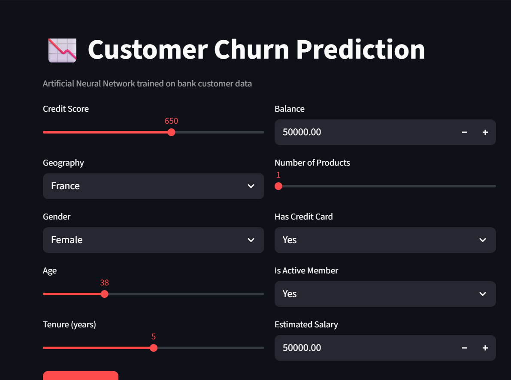
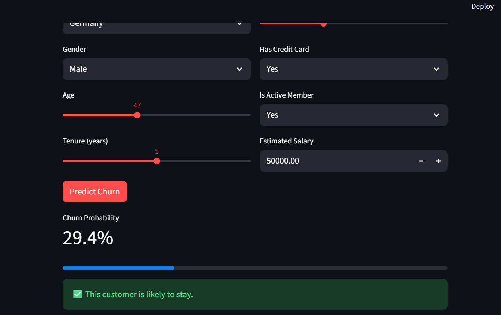
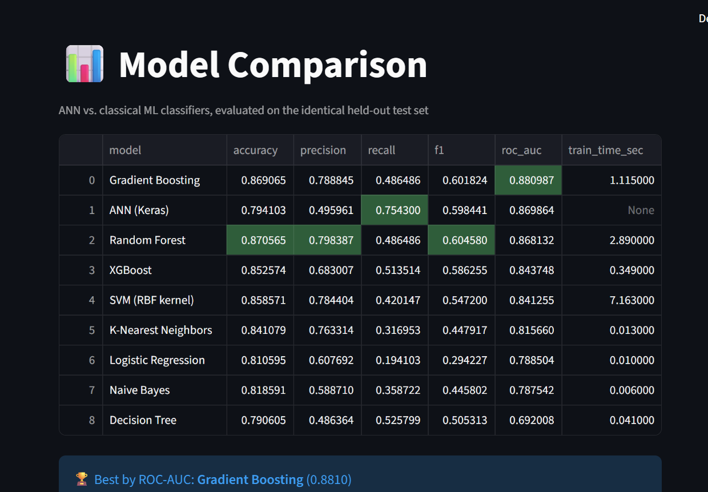
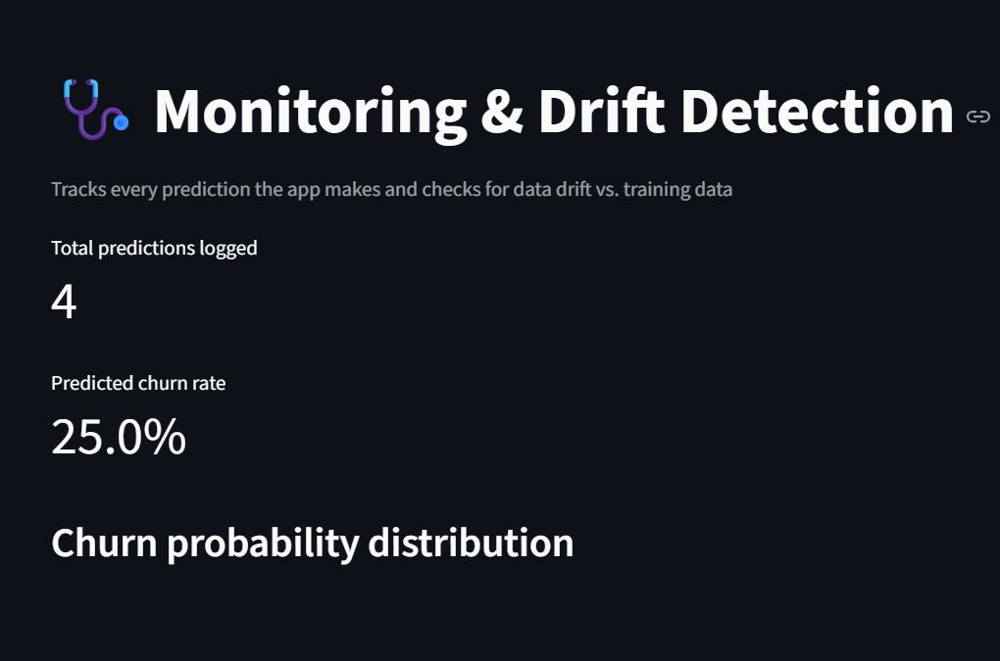

# 🚀 Customer Churn Prediction — ANN + ML Comparison + MLOps


## 🌐 Live Demo

https://sajidali-ds-customer-churn-prediction-mlops-app-uazuh6.streamlit.app

---

# 📌 Project Overview

This project is a **production-ready Customer Churn Prediction System** built using **TensorFlow, Scikit-Learn, MLflow, Docker, GitHub Actions, and Streamlit**.

Instead of only training a neural network, this project demonstrates an **end-to-end Machine Learning workflow** used in real-world production environments.

The application allows users to:

- Predict customer churn using an Artificial Neural Network.
- Compare ANN performance with multiple Machine Learning algorithms.
- Track ML experiments using MLflow.
- Monitor incoming predictions.
- Detect data drift using statistical testing.
- Deploy the application using Streamlit Cloud and Docker.
- Automate testing with GitHub Actions.

---

# ✨ Features

- 🤖 Artificial Neural Network (TensorFlow/Keras)
- 📊 Comparison with 8 Machine Learning Algorithms
- 📈 MLflow Experiment Tracking
- 📦 MLflow Model Registry
- 🐳 Docker Support
- 🚀 Streamlit Deployment
- ⚙ GitHub Actions CI/CD
- 📉 Data Drift Detection (Kolmogorov–Smirnov Test)
- 📝 Prediction Logging
- 🧪 Unit Testing with PyTest
- 🔄 Shared preprocessing pipeline for training and inference

---

# 🛠 Tech Stack

| Category | Technologies |
|-----------|--------------|
| Language | Python |
| Machine Learning | TensorFlow, Scikit-Learn, XGBoost |
| Data Analysis | Pandas, NumPy, SciPy |
| Visualization | Matplotlib |
| MLOps | MLflow |
| Deployment | Streamlit Cloud, Docker |
| Automation | GitHub Actions |
| Testing | PyTest |

---

# 📂 Project Structure

```text
customer-churn-prediction-mlops/
│
├── .github/
│   └── workflows/
│       ├── ci.yml
│       └── cd.yml
│
├── artifacts/
│
├── assets/
│   └── images/
│       ├── home.png
│       ├── prediction.png
│       ├── comparison.png
│       └── monitoring.png
│
├── src/
│   ├── compare_models.py
│   ├── data_preprocessing.py
│   ├── evaluate.py
│   ├── model.py
│   ├── monitoring.py
│   ├── predict.py
│   ├── train.py
│   └── utils.py
│
├── tests/
│
├── app.py
├── config.yaml
├── requirements.txt
├── Dockerfile
├── README.md
└── Churn_Modelling.csv
```

# ⚙ Machine Learning Pipeline

```text
Customer Dataset
        │
        ▼
Data Preprocessing
        │
        ▼
Feature Engineering
        │
        ▼
ANN Training
        │
        ▼
MLflow Tracking
        │
        ▼
Model Evaluation
        │
        ▼
Model Registry
        │
        ▼
Streamlit Deployment
        │
        ▼
Prediction Logging
        │
        ▼
Drift Detection
```

---

---

# 📸 Application Preview

## 🏠 Home Page



---

## 🎯 Prediction Page



---

## 📊 Model Comparison



---

## 📉 Monitoring Dashboard



---

# 🚀 Getting Started

## Clone Repository

```bash
git clone https://github.com/sajidali-ds/customer-churn-prediction-mlops.git

cd customer-churn-prediction-mlops
```

---

## Install Dependencies

```bash
pip install -r requirements.txt
```

---

## Train Model

```bash
python -m src.train
```

---

## Compare Models

```bash
python -m src.compare_models
```

---

## Run Tests

```bash
pytest tests/ -v
```

---

## Launch Streamlit

```bash
streamlit run app.py
```

---

# 🐳 Docker

Build Docker image

```bash
docker build -t churn-app .
```

Run Docker container

```bash
docker run -p 8501:8501 churn-app
```

---

# 📈 MLflow Experiment Tracking

Launch MLflow UI

```bash
mlflow ui --backend-store-uri sqlite:///mlflow.db
```

Open:

```
http://localhost:5000
```

MLflow provides:

- Experiment Tracking
- Hyperparameter Logging
- Metric Comparison
- Model Versioning
- Model Registry

---

# 📊 Machine Learning Models

This project compares the ANN against multiple classical Machine Learning algorithms.

- Logistic Regression
- Decision Tree
- Random Forest
- Gradient Boosting
- KNN
- Naive Bayes
- Support Vector Machine
- XGBoost
- Artificial Neural Network

All models are trained and evaluated using the same preprocessing pipeline and identical test split.

---

# 📈 Monitoring

The application continuously records predictions and performs statistical drift detection using the Kolmogorov–Smirnov Test.

This enables monitoring of feature distribution changes that may indicate the need for model retraining.

---

# 🧪 CI/CD

GitHub Actions automatically:

- Install dependencies
- Run unit tests
- Validate project
- Build Docker image
- Push Docker image

---

# 🎯 Future Improvements

- SHAP Explainability
- FastAPI REST API
- Kubernetes Deployment
- Airflow Pipeline
- AWS Deployment
- Model Monitoring Dashboard
- Email Alerts for Drift Detection

---

# 🤝 Contributing

Contributions are welcome.

Feel free to fork the repository, open issues, or submit pull requests.

---

# 👨‍💻 Author

**Sajid Ali**

GitHub:
https://github.com/sajidali-ds


# ⭐ Support

If you found this project useful, please consider giving it a ⭐ on GitHub.
